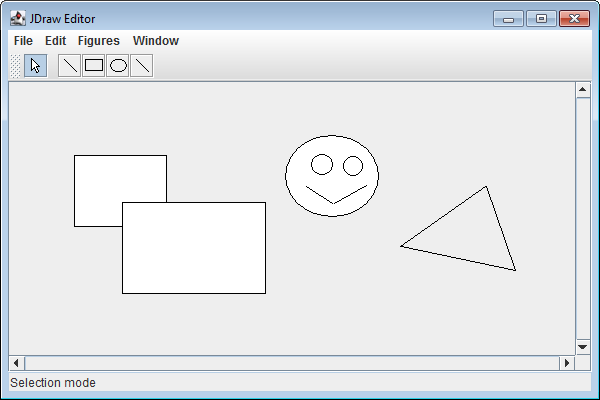

# jdraw-assignment 2021

This is the given implementation for the JDras graphics editor. You will extend the functionality of this graphics editor in subsequent assignments. So stay ahead and do not give up!

Primarily the interfaces which define the graphics editor are given (they are defined in the Java package `jdraw.framework`). Your task is to understand the interaction between these interfaces and to implement them. In addition to these interfaces an implementation of `DrawView` is provided in class `jdraw.std.StdDrawView`, and the implementation of a first figure is also given.

